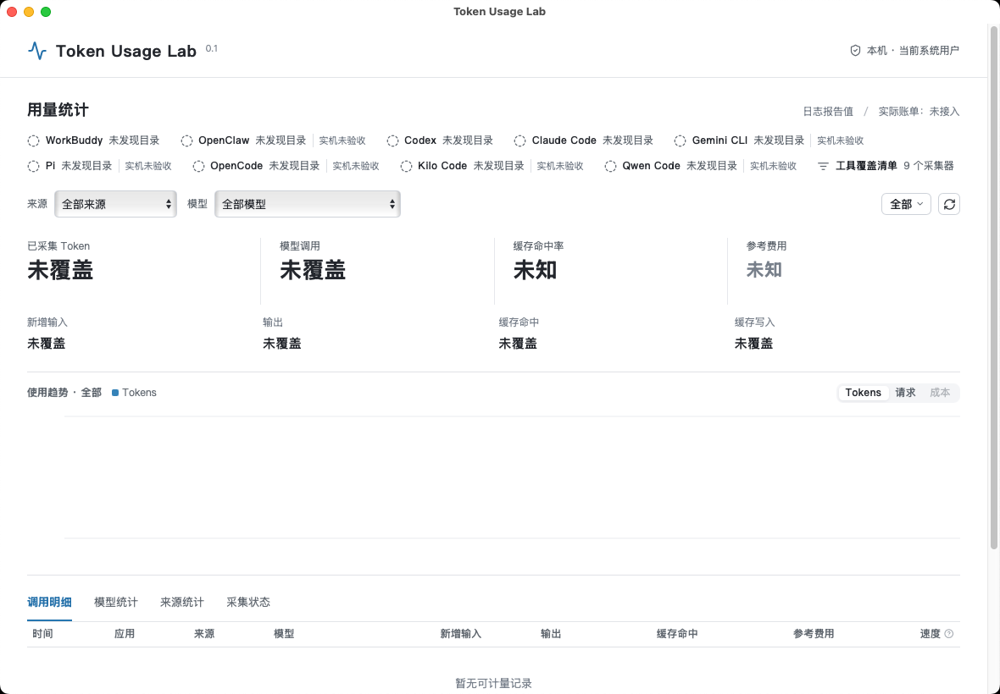

# Token Usage Lab

本地、只读的跨工具 Token 用量统计桌面应用。基于 [CC Switch](https://github.com/farion1231/cc-switch) 的统计界面与技术栈独立开发，使用 MIT 许可证，不是 CC Switch 官方版本。

## 下载与安装

当前分发版本：**v0.1.0-beta.2，公开测试版**。本次新增 Windows EXE 安装包，Mac 沿用 beta.1。普通用户无需下载源码、安装开发环境或配置 API Key。

| 你的电脑              | 下载                                                                                                                                                  | 安装方法                          |
| --------------------- | ----------------------------------------------------------------------------------------------------------------------------------------------------- | --------------------------------- |
| Mac，Apple M 系列芯片 | [下载 DMG](https://github.com/zjun96472-blip/token-usage-lab/releases/download/v0.1.0-beta.1/TokenUsageLab-0.1.0-beta.1-macos-apple-silicon.dmg)      | 打开 DMG，将应用拖入 Applications |
| Mac，Intel 芯片       | [下载 DMG](https://github.com/zjun96472-blip/token-usage-lab/releases/download/v0.1.0-beta.1/TokenUsageLab-0.1.0-beta.1-macos-intel.dmg)              | 打开 DMG，将应用拖入 Applications |
| Windows x64           | [下载 EXE 安装包](https://github.com/zjun96472-blip/token-usage-lab/releases/download/v0.1.0-beta.2/TokenUsageLab-0.1.0-beta.2-windows-x64-Setup.exe) | 双击安装，从开始菜单打开          |

[所有版本与更新记录](https://github.com/zjun96472-blip/token-usage-lab/releases) · [Mac 使用说明书](docs/MACOS-MANUAL.md) · [Windows 安装说明](docs/WINDOWS-INSTALLER.md)

Windows 安装包包含程序、中文 `README.md` 说明书、许可证、开始菜单入口和卸载程序，默认只安装到当前用户。缺少 WebView2 时会联网调用 Microsoft 官方安装程序。仍需免安装版时可选择 [Windows 便携 ZIP](https://github.com/zjun96472-blip/token-usage-lab/releases/download/v0.1.0-beta.1/TokenUsageLab-0.1.0-beta.1-windows-x64.zip)。

交给本地 Agent 安装时，可以使用 [beta.1 Release](https://github.com/zjun96472-blip/token-usage-lab/releases/tag/v0.1.0-beta.1) 中名称含 `with-guide.zip` 的 Mac 分享包，内含 `README.md`、安装文件和校验清单。GitHub 自动提供的 **Source code** 压缩包是开发者源码，不是安装程序。

**安全提示：**Mac 包没有 Apple Developer ID 签名或公证，Windows 包也未数字签名，首次打开可能被系统或公司策略拦截。请确认来源、核对 Release 的 SHA-256 清单，按系统单应用授权流程或联系 IT 处理；不要关闭防护、删除隔离属性或运行绕过脚本。校验和不能替代发布者身份验证。

Mac 构建目标为 macOS 12 及以上，原生启动已在 macOS 15.7.9 的 Apple Silicon、Intel 环境验证；旧系统和真实 Mac 工具日志仍待实机验证。Windows 包在 Windows 11 x64 开发机完成运行验收，需要系统具备 Microsoft Edge WebView2 Runtime；不宣称已验证全部 Windows 设备。

## 界面



截图来自不含用户日志的 macOS CI 环境，因此显示“未覆盖 / 未知”，不是演示用量或虚构账单。

## 当前覆盖

| 来源                                                     | 当前状态                                     |
| -------------------------------------------------------- | -------------------------------------------- |
| WorkBuddy、Codex CLI / IDE / Desktop、Claude Code        | 已有 Windows 本地日志验证，仍为部分覆盖      |
| OpenClaw、Gemini CLI、Pi、OpenCode、Kilo Code、Qwen Code | 适配器和合成测试已接入，真实工具日志仍待验证 |

仅读取当前系统用户的默认本地日志目录。OpenCode、Kilo 仅支持列明的新版 SQLite；自定义目录、其他系统用户、远程设备及网页端不自动覆盖。**九个采集器不等于所有工具、所有版本、全部调用都已覆盖。**

Cursor、Windsurf、Trae、Copilot、Cline、Roo、CodeBuddy、Continue、Aider 等尚未宣称接入。完整路径、支持范围和未覆盖项见 [覆盖清单](docs/COVERAGE.md)。

## 数据口径与隐私

- 统计日志中明确报告的 Token，不把积分、文本长度或请求数换算成 Token。
- 按来源、稳定调用身份和修订规则去重，处理缓存包含关系；重复扫描不应重复累计。
- 参考费用未知，实际账单未接入；缺数据、缺字段或不支持的格式不会伪装成零。
- 当前用户是采集范围，不被自动认定为所有后台任务的实际发起人。
- 只保存计量所需的模型、时间、计数、哈希身份和状态，不保存聊天正文、工具参数、原始日志或密钥。
- 不上传、不云同步、不代理模型请求、不修改其他工具配置，也不读取或迁移 CC Switch 数据库。

默认账本目录：Windows 为 `%LOCALAPPDATA%/TokenUsageLab`，Mac 为 `~/Library/Application Support/TokenUsageLab`。应用标识：`local.tokenusagelab.desktop`。

实现约束见 [数据契约](docs/DATA_CONTRACT.md)，字段来源见 [适配器依据](docs/ADAPTER_SOURCES.md)。当前没有应用内自动更新；新版本从 Releases 下载。

## 开发与贡献

React 18、TypeScript、Vite、Tauri 2、Rust、SQLite。源码使用 UTF-8 无 BOM，每个实际源码文件不超过 3000 行。

```sh
corepack enable
corepack prepare pnpm@10.12.3 --activate
pnpm install --frozen-lockfile
pnpm typecheck
pnpm test:unit
node --test scripts/tests/*.test.mjs
cargo test --locked --manifest-path src-tauri/Cargo.toml --lib
pnpm dev:desktop
```

桌面开发需要对应系统的 Rust 和原生工具链。浏览器预览、Mac 构建和 Windows 构建见 [开发与构建](docs/BUILDING.md)。CI 运行合成测试，不读取维护者或贡献者的真实 AI 会话。

[贡献指南](CONTRIBUTING.md) · [问题反馈](https://github.com/zjun96472-blip/token-usage-lab/issues) · [安全报告](SECURITY.md) · [更新记录](CHANGELOG.md)

提交问题时请说明系统、芯片、工具版本和已遮挡个人信息的采集状态；不要上传聊天日志、数据库、密钥或配置文件。

## 许可证与来源

遵循 [MIT 许可证](LICENSE)，保留 CC Switch 原作者版权声明。上游基线为 `farion1231/cc-switch@5ae6ad3888ba4543f6fad343c87656a97bd69da4`。本项目保留统计界面、查询和本地采集能力，去掉模型切换、配置管理、代理及原版更新入口。

应用图标基于 Lucide Activity，Lucide 采用 ISC 许可证；发布包附第三方依赖声明。本仓库从审查后的源码快照开始，不包含原开发机历史、日志、数据库或凭证。首个预发布的安装文件沿用此前验收版本，来源及哈希记载于 Release 附件 `PROVENANCE.json`；不声称实现了逐字节可复现构建。
